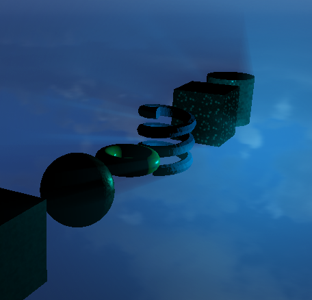
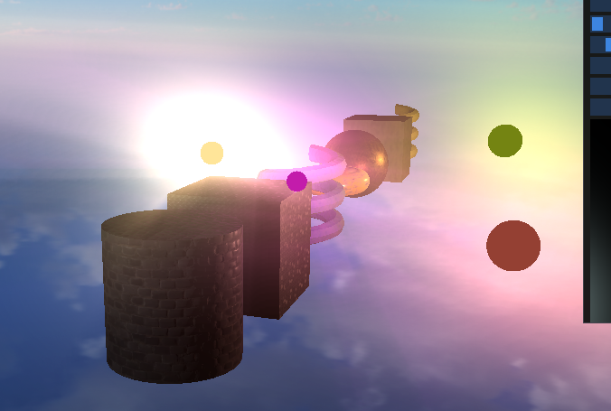

This project features Volumetric Light Rays.

This includes both directional lights and point lights.

It also has partial support for rendering rays from multiple lights at once (looks a bit off when there are both directional and point types; try viewing the scene with only point lights)

Light rays also match the light's color, and the strength of the rays match the light's intensity and range. 

You can play around with the Light Ray post process values in the ImGUI debug panel.